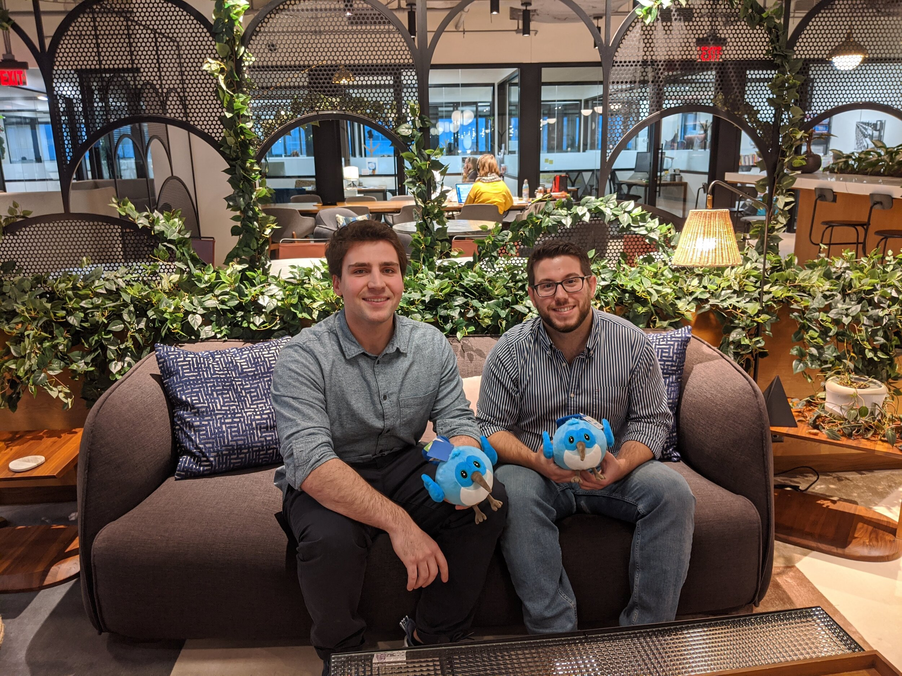
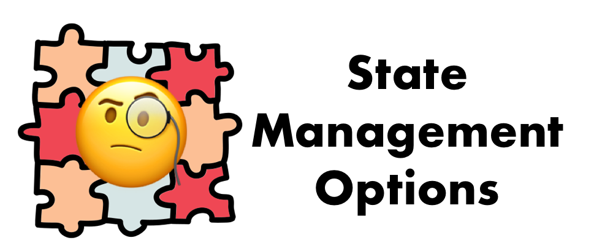
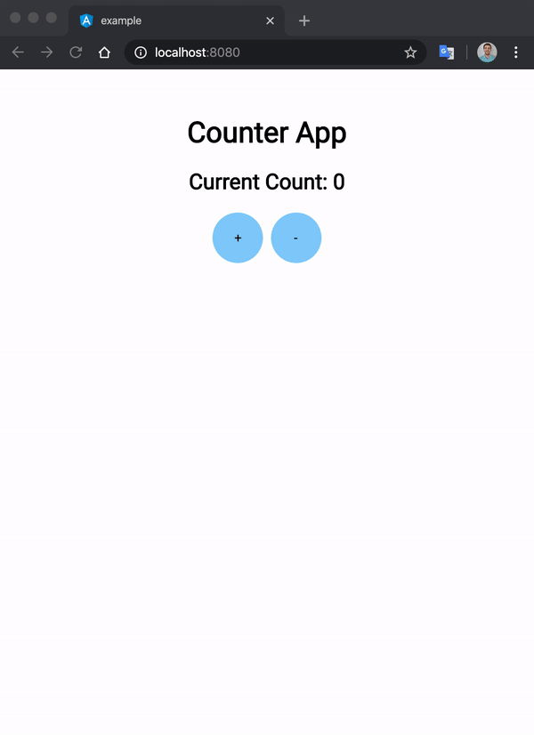
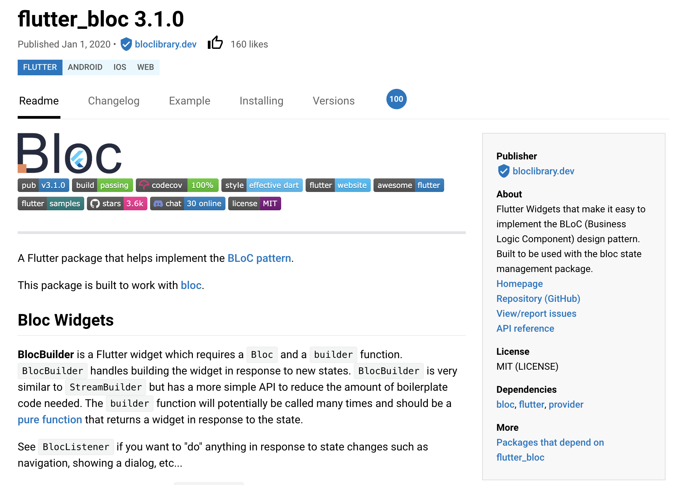
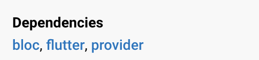
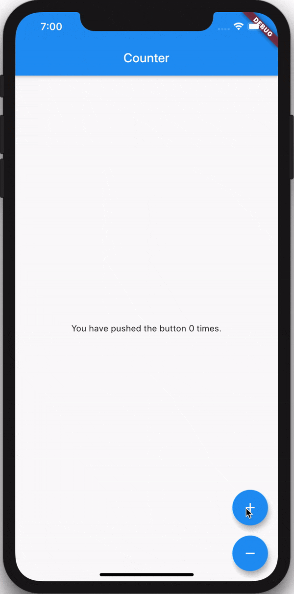
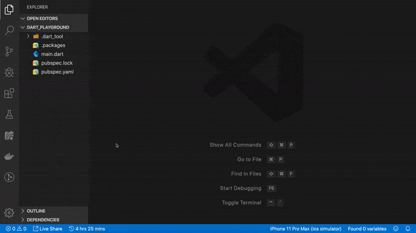
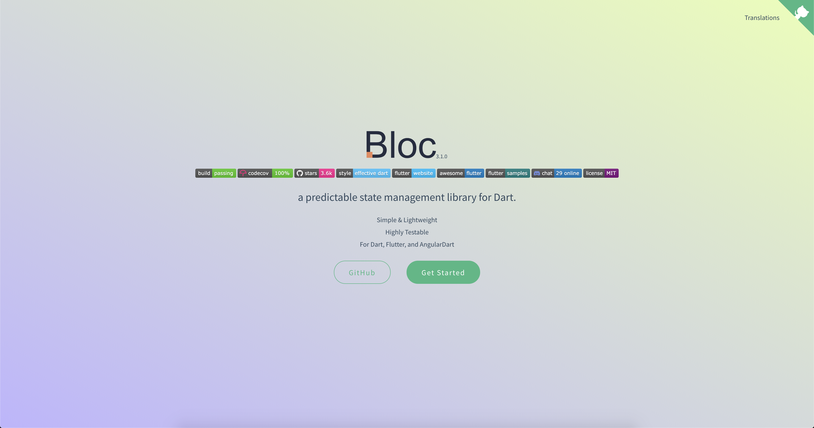

footer: @felangelov - flutter europe 2020
slidenumbers: true

# Bloc Library: Basics & Beyond 🚀

### Felix Angelov @ Very Good Ventures

---

# about me

 

^ started at BMW about 4 years ago. using flutter for last 2 years. rebuild BMW mobile app in Flutter. joined VGV in Jan.

---

# VGV Chicago 🕶️🦄



^ opened an office with my friend/teammate, Jorge. if interested in learning more about VGV reach out.

---


[.footer: https://memeshappen.com/meme/one-does-not-simply-a/one-does-not-simply-create-a-successful-app-29206/9]

^ so rewind 2 years, we were asked to rewrite the BMW app in Flutter. we had to get it right

---

# Goals

☐ decouple UI & business logic

☐ easy to test

☐ predictable/consistent

---



[.footer: https://medium.com/flutter-community/let-me-help-you-to-understand-and-choose-a-state-management-solution-for-your-app-9ffeac834ee3]

^ so we did tons of research and specifically with regard to state management we decided on an approach. Teammate, Jorge wrote an article about our strategy. It's not surprise that we ended up pivoting many times since then.

---

# Evolution is Key

---

# Packages

- package:bloc - Core (Dart)

- package:bloc_test - Testing Helpers (Dart)

- package:flutter_bloc - Flutter Widgets

- ~~package:angular_bloc - AngularDart Components~~

---

# Packages

- **package:bloc - Core (Dart)**

- package:bloc_test - Testing Helpers (Dart)

- package:flutter_bloc - Flutter Widgets

- ~~package:angular_bloc - AngularDart Components~~

---

# Packages

- package:bloc - Core (Dart)

- **package:bloc_test - Testing Helpers (Dart)**

- package:flutter_bloc - Flutter Widgets

- ~~package:angular_bloc - AngularDart Components~~

---

# Packages

- package:bloc - Core (Dart)

- package:bloc_test - Testing Helpers (Dart)

- **package:flutter_bloc - Flutter Widgets**

- ~~package:angular_bloc - AngularDart Components~~

---

# Packages

- package:bloc - Core (Dart)

- package:bloc_test - Testing Helpers (Dart)

- package:flutter_bloc - Flutter Widgets

- **~~package:angular_bloc - AngularDart Components~~**

---

# Packages

- **package:bloc - Core (Dart)**

- package:bloc_test - Testing Helpers (Dart)

- package:flutter_bloc - Flutter Widgets

- ~~package:angular_bloc - AngularDart Components~~

---

# Overview


> A bloc converts incoming events into outgoing states.

---

# Real-World


---

# Real-World: Increment


---

# package:bloc

```yaml
name: counter_bloc
description: A counter bloc example
version: 1.0.0

environment:
  sdk: ">=2.0.0 <3.0.0"

dependencies:
  bloc: ^3.0.0
```

---

[.code-highlight: 8-9]

# package:bloc

```yaml
name: counter_bloc
description: A counter bloc example
version: 1.0.0

environment:
  sdk: ">=2.0.0 <3.0.0"

dependencies:
  bloc: ^3.0.0
```

---

# Bloc Anatomy

```dart
import 'dart:async';
import 'package:bloc/bloc.dart';
```

---

# Bloc Anatomy

[.code-highlight: 4]

```dart
import 'dart:async';
import 'package:bloc/bloc.dart';

enum CounterEvent { increment, decrement }
```

---

# Bloc Anatomy

[.code-highlight: 6]

```dart
import 'dart:async';
import 'package:bloc/bloc.dart';

enum CounterEvent { increment, decrement }

class CounterBloc extends Bloc<CounterEvent, int> {}
```

---

# Bloc Anatomy

[.code-highlight: 7-8]

```dart
import 'dart:async';
import 'package:bloc/bloc.dart';

enum CounterEvent { increment, decrement }

class CounterBloc extends Bloc<CounterEvent, int> {
    @override
    int get initialState => 0;
}
```

---

# Bloc Anatomy

[.code-highlight: 6-9]

```dart
...

class CounterBloc extends Bloc<CounterEvent, int> {
    ...

    @override
    Stream<int> mapEventToState(CounterEvent event) async* {

    }
}
```

---

# Bloc Anatomy

[.code-highlight: 8-10]

```dart
...

class CounterBloc extends Bloc<CounterEvent, int> {
    ...

    @override
    Stream<int> mapEventToState(CounterEvent event) async* {
        switch (event) {

        }
    }
}
```

---

# Bloc Anatomy

[.code-highlight: 9-11]

```dart
...

class CounterBloc extends Bloc<CounterEvent, int> {
    ...

    @override
    Stream<int> mapEventToState(CounterEvent event) async* {
        switch (event) {
            case CounterEvent.increment:
                yield state + 1;
                break;
        }
    }
}
```

---

# Bloc Anatomy

[.code-highlight: 12-14]

```dart
...

class CounterBloc extends Bloc<CounterEvent, int> {
    ...

    @override
    Stream<int> mapEventToState(CounterEvent event) async* {
        switch (event) {
            case CounterEvent.increment:
                yield state + 1;
                break;
            case CounterEvent.decrement:
                yield state - 1;
                break;
        }
    }
}
```

---

# Bloc Anatomy

```dart
import 'dart:async';
import 'package:bloc/bloc.dart';

enum CounterEvent { increment, decrement }

class CounterBloc extends Bloc<CounterEvent, int> {
    @override
    int get initialState => 0;

    @override
    Stream<int> mapEventToState(CounterEvent event) async* {
        switch (event) {
            case CounterEvent.increment:
                yield state + 1;
                break;
            case CounterEvent.decrement:
                yield state - 1;
                break;
        }
    }
}
```

---

# Bloc in Action

```dart
import 'counter_bloc.dart';

void main() {
    final counterBloc = CounterBloc();

    counterBloc.listen(print);

    counterBloc.add(CounterEvent.increment);
    counterBloc.add(CounterEvent.decrement);
}
```

---

# Bloc in Action

[.code-highlight: 1]

```dart
import 'counter_bloc.dart';

void main() {
    final counterBloc = CounterBloc();

    counterBloc.listen(print);

    counterBloc.add(CounterEvent.increment);
    counterBloc.add(CounterEvent.decrement);
}
```

---

# Bloc in Action

[.code-highlight: 4]

```dart
import 'counter_bloc.dart';

void main() {
    final counterBloc = CounterBloc();

    counterBloc.listen(print);

    counterBloc.add(CounterEvent.increment);
    counterBloc.add(CounterEvent.decrement);
}
```

---

# Bloc in Action

[.code-highlight: 6]

```dart
import 'counter_bloc.dart';

void main() {
    final counterBloc = CounterBloc();

    counterBloc.listen(print);

    counterBloc.add(CounterEvent.increment);
    counterBloc.add(CounterEvent.decrement);
}
```

---

# Bloc in Action

[.code-highlight: 8]

```dart
import 'counter_bloc.dart';

void main() {
    final counterBloc = CounterBloc();

    counterBloc.listen(print);

    counterBloc.add(CounterEvent.increment);
    counterBloc.add(CounterEvent.decrement);
}
```

---

# Bloc in Action

[.code-highlight: 9]

```dart
import 'counter_bloc.dart';

void main() {
    final counterBloc = CounterBloc();

    counterBloc.listen(print);

    counterBloc.add(CounterEvent.increment);
    counterBloc.add(CounterEvent.decrement);
}
```

---

# Bloc in Action

```sh
$ dart example/main.dart
0
1
0
```

---

# Bloc in Action

[.code-highlight: 1]

```sh
$ dart example/main.dart
0
1
0
```

---

# Bloc in Action

[.code-highlight: 2]

```sh
$ dart example/main.dart
0 // initialState
1
0
```

---

# Bloc in Action

[.code-highlight: 3]

```sh
$ dart example/main.dart
0
1 // CounterEvent.increment
0
```

---

# Bloc in Action

[.code-highlight: 4]

```sh
$ dart example/main.dart
0
1
0 // CounterEvent.decrement
```

---

# Separation of Concerns


---




---

# Goals

**☑️ decouple UI & business logic**

☐ easy to test

☐ predictable/consistent

---

# Goals

☑️ decouple UI & business logic

**☐ easy to test**

☐ predictable/consistent

---

# Packages

- package:bloc - Core (Dart)

- **package:bloc_test - Testing Helpers (Dart)**

- package:flutter_bloc - Flutter Widgets

- ~~package:angular_bloc - AngularDart Components~~

---

# package:bloc_test

```yaml
name: counter_bloc
description: A counter bloc example
version: 1.0.0

environment:
  sdk: ">=2.0.0 <3.0.0"

dependencies:
  bloc: ^3.0.0

dev_dependencies:
  test: ^1.11.1
  bloc_test: ^3.0.0
```

---

[.code-highlight: 11-13]

# package:bloc_test

```yaml
name: counter_bloc
description: A counter bloc example
version: 1.0.0

environment:
  sdk: ">=2.0.0 <3.0.0"

dependencies:
  bloc: ^3.0.0

dev_dependencies:
  test: ^1.11.1
  bloc_test: ^3.0.0
```

---

# bloc_test Anatomy

```dart
import 'package:test/test.dart';
import 'package:bloc_test/bloc_test.dart';

import '../counter_bloc.dart';

void main() {
  group('CounterBloc', () {
    blocTest(
      'emits [0] when no events are added',
      build: () => CounterBloc(),
      expect: [0],
    );
  });
}
```

---

[.code-highlight: 6,14]

# bloc_test Anatomy

```dart
import 'package:test/test.dart';
import 'package:bloc_test/bloc_test.dart';

import '../counter_bloc.dart';

void main() {
  group('CounterBloc', () {
    blocTest(
      'emits [0] when no events are added',
      build: () => CounterBloc(),
      expect: [0],
    );
  });
}
```

---

[.code-highlight: 1, 7, 13]

# bloc_test Anatomy

```dart
import 'package:test/test.dart';
import 'package:bloc_test/bloc_test.dart';

import '../counter_bloc.dart';

void main() {
  group('CounterBloc', () {
    blocTest(
      'emits [0] when no events are added',
      build: () => CounterBloc(),
      expect: [0],
    );
  });
}
```

---

[.code-highlight: 2, 4, 8-12]

# bloc_test Anatomy

```dart
import 'package:test/test.dart';
import 'package:bloc_test/bloc_test.dart';

import '../counter_bloc.dart';

void main() {
  group('CounterBloc', () {
    blocTest(
      'emits [0] when no events are added',
      build: () => CounterBloc(),
      expect: [0],
    );
  });
}
```

---

[.code-highlight: 9]

# bloc_test Anatomy

```dart
import 'package:test/test.dart';
import 'package:bloc_test/bloc_test.dart';

import '../counter_bloc.dart';

void main() {
  group('CounterBloc', () {
    blocTest(
      'emits [0] when no events are added',
      build: () => CounterBloc(),
      expect: [0],
    );
  });
}
```

---

[.code-highlight: 10]

# bloc_test Anatomy

```dart
import 'package:test/test.dart';
import 'package:bloc_test/bloc_test.dart';

import '../counter_bloc.dart';

void main() {
  group('CounterBloc', () {
    blocTest(
      'emits [0] when no events are added',
      build: () => CounterBloc(),
      expect: [0],
    );
  });
}
```

---

[.code-highlight: 11]

# bloc_test Anatomy

```dart
import 'package:test/test.dart';
import 'package:bloc_test/bloc_test.dart';

import '../counter_bloc.dart';

void main() {
  group('CounterBloc', () {
    blocTest(
      'emits [0] when no events are added',
      build: () => CounterBloc(),
      expect: [0],
    );
  });
}
```

---

# bloc_test Anatomy

```dart
import 'package:test/test.dart';
import 'package:bloc_test/bloc_test.dart';

import '../counter_bloc.dart';

void main() {
  group('CounterBloc', () {
    blocTest(
      'emits [0] when no events are added',
      build: () => CounterBloc(),
      expect: [0],
    );
  });
}
```

---

# bloc_test in Action

```sh
$ pub run test
✓ CounterBloc emits [0] when no events are added
00:01 +1: All tests passed!
```

---

[.code-highlight: 1]

# bloc_test in Action

```sh
$ pub run test
✓ CounterBloc emits [0] when no events are added
00:01 +1: All tests passed!
```

---

[.code-highlight: 2]

# bloc_test in Action

```sh
$ pub run test
✓ CounterBloc emits [0] when no events are added
00:01 +1: All tests passed!
```

---

[.code-highlight: 3]

# bloc_test in Action

```sh
$ pub run test
✓ CounterBloc emits [0] when no events are added
00:01 +1: All tests passed!
```

---

# One More Time

```dart
import 'package:test/test.dart';
import 'package:bloc_test/bloc_test.dart';

import '../counter_bloc.dart';

void main() {
  group('CounterBloc', () {
    ...

    blocTest(
      'emits [0, 1] when CounterEvent.increment is added',
      build: () => CounterBloc(),
      act: (counterBloc) => counterBloc.add(CounterEvent.increment),
      expect: [0, 1],
    );
  });
}

```

---

[.code-highlight: 10-15]

# One More Time

```dart
import 'package:test/test.dart';
import 'package:bloc_test/bloc_test.dart';

import '../counter_bloc.dart';

void main() {
  group('CounterBloc', () {
    ...

    blocTest(
      'emits [0, 1] when CounterEvent.increment is added',
      build: () => CounterBloc(),
      act: (counterBloc) => counterBloc.add(CounterEvent.increment),
      expect: [0, 1],
    );
  });
}
```

---

[.code-highlight: 11]

# One More Time

```dart
import 'package:test/test.dart';
import 'package:bloc_test/bloc_test.dart';

import '../counter_bloc.dart';

void main() {
  group('CounterBloc', () {
    ...

    blocTest(
      'emits [0, 1] when CounterEvent.increment is added',
      build: () => CounterBloc(),
      act: (counterBloc) => counterBloc.add(CounterEvent.increment),
      expect: [0, 1],
    );
  });
}
```

---

[.code-highlight: 12]

# One More Time

```dart
import 'package:test/test.dart';
import 'package:bloc_test/bloc_test.dart';

import '../counter_bloc.dart';

void main() {
  group('CounterBloc', () {
    ...

    blocTest(
      'emits [0, 1] when CounterEvent.increment is added',
      build: () => CounterBloc(),
      act: (counterBloc) => counterBloc.add(CounterEvent.increment),
      expect: [0, 1],
    );
  });
}
```

---

[.code-highlight: 13]

# One More Time

```dart
import 'package:test/test.dart';
import 'package:bloc_test/bloc_test.dart';

import '../counter_bloc.dart';

void main() {
  group('CounterBloc', () {
    ...

    blocTest(
      'emits [0, 1] when CounterEvent.increment is added',
      build: () => CounterBloc(),
      act: (counterBloc) => counterBloc.add(CounterEvent.increment),
      expect: [0, 1],
    );
  });
}
```

---

[.code-highlight: 14]

# One More Time

```dart
import 'package:test/test.dart';
import 'package:bloc_test/bloc_test.dart';

import '../counter_bloc.dart';

void main() {
  group('CounterBloc', () {
    ...

    blocTest(
      'emits [0, 1] when CounterEvent.increment is added',
      build: () => CounterBloc(),
      act: (counterBloc) => counterBloc.add(CounterEvent.increment),
      expect: [0, 1],
    );
  });
}
```

---

# One More Time

```dart
import 'package:test/test.dart';
import 'package:bloc_test/bloc_test.dart';

import '../counter_bloc.dart';

void main() {
  group('CounterBloc', () {
    ...

    blocTest(
      'emits [0, 1] when CounterEvent.increment is added',
      build: () => CounterBloc(),
      act: (counterBloc) => counterBloc.add(CounterEvent.increment),
      expect: [0, 1],
    );
  });
}
```

---

# One More Time

```dart
import 'package:test/test.dart';
import 'package:bloc_test/bloc_test.dart';

import '../counter_bloc.dart';

void main() {
  group('CounterBloc', () {
    ...

    blocTest(
      'emits [0, -1] when CounterEvent.decrement is added',
      build: () => CounterBloc(),
      act: (counterBloc) => counterBloc.add(CounterEvent.decrement),
      expect: [0, -1],
    );
  });
}
```

---

[.code-highlight: 10-15]

# One More Time

```dart
import 'package:test/test.dart';
import 'package:bloc_test/bloc_test.dart';

import '../counter_bloc.dart';

void main() {
  group('CounterBloc', () {
    ...

    blocTest(
      'emits [0, -1] when CounterEvent.decrement is added',
      build: () => CounterBloc(),
      act: (counterBloc) => counterBloc.add(CounterEvent.decrement),
      expect: [0, -1],
    );
  });
}
```

---

# One More Time

```dart
import 'package:test/test.dart';
import 'package:bloc_test/bloc_test.dart';

import '../counter_bloc.dart';

void main() {
  group('CounterBloc', () {
    ...

    blocTest(
      'emits [0, -1] when CounterEvent.decrement is added',
      build: () => CounterBloc(),
      act: (counterBloc) => counterBloc.add(CounterEvent.decrement),
      expect: [0, -1],
    );
  });
}
```

---

# All Tests in Action

```sh
$ pub run test
✓ CounterBloc emits [0] when no events are added
✓ CounterBloc emits [0, 1] when CounterEvent.increment is added
✓ CounterBloc emits [0, -1] when CounterEvent.decrement is added
00:01 +3: All tests passed!
```

---

[.code-highlight: 1]

# All Tests in Action

```sh
$ pub run test
✓ CounterBloc emits [0] when no events are added
✓ CounterBloc emits [0, 1] when CounterEvent.increment is added
✓ CounterBloc emits [0, -1] when CounterEvent.decrement is added
00:01 +3: All tests passed!
```

---

[.code-highlight: 2-4]

# All Tests in Action

```sh
$ pub run test
✓ CounterBloc emits [0] when no events are added
✓ CounterBloc emits [0, 1] when CounterEvent.increment is added
✓ CounterBloc emits [0, -1] when CounterEvent.decrement is added
00:01 +3: All tests passed!
```

---

[.code-highlight: 5]

# All Tests in Action

```sh
$ pub run test
✓ CounterBloc emits [0] when no events are added
✓ CounterBloc emits [0, 1] when CounterEvent.increment is added
✓ CounterBloc emits [0, -1] when CounterEvent.decrement is added
00:01 +3: All tests passed!
```

---

# Goals

☑️ decouple UI & business logic

**☑️ easy to test**

☐ predictable/consistent

---

# Goals

☑️ decouple **UI** & business logic

☑️ easy to test

☐ predictable/consistent

---

# Packages

- package:bloc - Core (Dart)

- package:bloc_test - Testing Helpers (Dart)

- **package:flutter_bloc - Flutter Widgets**

- ~~package:angular_bloc - AngularDart Components~~

---

# package:flutter_bloc

```yaml
name: counter_app
description: A counter app example
version: 1.0.0

environment:
  sdk: ">=2.0.0 <3.0.0"

dependencies:
  flutter:
    sdk: flutter
  flutter_bloc: ^3.0.0
  counter_bloc:
    path: ../counter_bloc

flutter:
  uses-material-design: true
```

---

[.code-highlight: 9-10]

# package:flutter_bloc

```yaml
name: counter_app
description: A counter app example
version: 1.0.0

environment:
  sdk: ">=2.0.0 <3.0.0"

dependencies:
  flutter:
    sdk: flutter
  flutter_bloc: ^3.0.0
  counter_bloc:
    path: ../counter_bloc

flutter:
  uses-material-design: true
```

---

[.code-highlight: 11]

# package:flutter_bloc

```yaml
name: counter_app
description: A counter app example
version: 1.0.0

environment:
  sdk: ">=2.0.0 <3.0.0"

dependencies:
  flutter:
    sdk: flutter
  flutter_bloc: ^3.0.0
  counter_bloc:
    path: ../counter_bloc

flutter:
  uses-material-design: true
```

---

[.code-highlight: 12-13]

# package:flutter_bloc

```yaml
name: counter_app
description: A counter app example
version: 1.0.0

environment:
  sdk: ">=2.0.0 <3.0.0"

dependencies:
  flutter:
    sdk: flutter
  flutter_bloc: ^3.0.0
  counter_bloc:
    path: ../counter_bloc

flutter:
  uses-material-design: true
```

---

# flutter_bloc in Action

```dart
import 'package:flutter/material.dart';
import 'package:flutter_bloc/flutter_bloc.dart';
import 'package:counter_bloc/counter_bloc.dart';

void main() => runApp(CounterApp());
```

---

[.code-highlight: 1-3]

# flutter_bloc in Action

```dart
import 'package:flutter/material.dart';
import 'package:flutter_bloc/flutter_bloc.dart';
import 'package:counter_bloc/counter_bloc.dart';

void main() => runApp(CounterApp());
```

---

[.code-highlight: 5]

# flutter_bloc in Action

```dart
import 'package:flutter/material.dart';
import 'package:flutter_bloc/flutter_bloc.dart';
import 'package:counter_bloc/counter_bloc.dart';

void main() => runApp(CounterApp());
```

---

# flutter_bloc in Action

```dart
...

class CounterApp extends StatelessWidget {
  @override
  Widget build(BuildContext context) {
    return MaterialApp(
      home: BlocProvider(
        create: (_) => CounterBloc(),
        child: CounterPage(),
      ),
    );
  }
}
```

---

[.code-highlight: 3, 13]

# flutter_bloc in Action

```dart
...

class CounterApp extends StatelessWidget {
  @override
  Widget build(BuildContext context) {
    return MaterialApp(
      home: BlocProvider(
        create: (_) => CounterBloc(),
        child: CounterPage(),
      ),
    );
  }
}
```

---

[.code-highlight: 4-5, 12]

# flutter_bloc in Action

```dart
...

class CounterApp extends StatelessWidget {
  @override
  Widget build(BuildContext context) {
    return MaterialApp(
      home: BlocProvider(
        create: (_) => CounterBloc(),
        child: CounterPage(),
      ),
    );
  }
}
```

---

[.code-highlight: 6, 11]

# flutter_bloc in Action

```dart
...

class CounterApp extends StatelessWidget {
  @override
  Widget build(BuildContext context) {
    return MaterialApp(
      home: BlocProvider(
        create: (_) => CounterBloc(),
        child: CounterPage(),
      ),
    );
  }
}
```

---

[.code-highlight: 7-10]

# flutter_bloc in Action

```dart
...

class CounterApp extends StatelessWidget {
  @override
  Widget build(BuildContext context) {
    return MaterialApp(
      home: BlocProvider(
        create: (_) => CounterBloc(),
        child: CounterPage(),
      ),
    );
  }
}
```

---

# Bloc**Provider** 🤔

---

# Bloc**Provider** 🧐



---

# Bloc**Provider** 😲



---

# Bloc**Provider** 😊


---

# BlocProvider Anatomy

> _makes a bloc available to a sub-tree_

```dart
BlocProvider(
  create: (BuildContext context) {
    return MyBloc();
  },
  child: MyChild(),
)
```

---

[.code-highlight: 2-4]

# BlocProvider Anatomy

> _makes a bloc available to a sub-tree_

```dart
BlocProvider(
  create: (BuildContext context) {
    return MyBloc();
  },
  child: MyChild(),
)
```

---

[.code-highlight: 5]

# BlocProvider Anatomy

> _makes a bloc available to a sub-tree_

```dart
BlocProvider(
  create: (BuildContext context) {
    return MyBloc();
  },
  child: MyChild(),
)
```

---

# BlocProvider Anatomy

```dart
class MyChild extends StatelessWidget {
  @override
  Widget build(BuildContext context) {
    final myBloc = BlocProvider.of<MyBloc>(context);

    ...
  }
}
```

---

[.code-highlight: 4]

# BlocProvider Anatomy

```dart
class MyChild extends StatelessWidget {
  @override
  Widget build(BuildContext context) {
    final myBloc = BlocProvider.of<MyBloc>(context);

    ...
  }
}
```

---

# dispose?

```dart
...

class _CounterAppState extends State<CounterApp> {
  CounterBloc _counterBloc;

  @override
  void initState() {
    super.initState();
    _counterBloc = CounterBloc();
  }

  @override
  Widget build(BuildContext context) {...}

  @override
  void dispose() {
    _counterBloc.close();
    super.dispose();
  }
}
```

---

[.code-highlight: 3, 20]

# dispose?

```dart
...

class _CounterAppState extends State<CounterApp> {
  CounterBloc _counterBloc;

  @override
  void initState() {
    super.initState();
    _counterBloc = CounterBloc();
  }

  @override
  Widget build(BuildContext context) {...}

  @override
  void dispose() {
    _counterBloc.close();
    super.dispose();
  }
}
```

---

[.code-highlight: 4, 6-10, 15-19]

# dispose?

```dart
...

class _CounterAppState extends State<CounterApp> {
  CounterBloc _counterBloc;

  @override
  void initState() {
    super.initState();
    _counterBloc = CounterBloc();
  }

  @override
  Widget build(BuildContext context) {...}

  @override
  void dispose() {
    _counterBloc.close();
    super.dispose();
  }
}
```

---

[.code-highlight: 9]

# BlocProvider Anatomy

> _by default BlocProvider automatically closes the provided bloc_

```dart
BlocProvider({
    Key key,
    @required Create<T> create,
    Widget child,
    bool lazy,
  }) : this._(
          key: key,
          create: create,
          dispose: (_, bloc) => bloc?.close(),
          child: child,
          lazy: lazy,
        );
```

---

# Multiple Blocs?

```dart
MultiBlocProvider(
  providers: [
    BlocProvider<BlocA>(
      create: (_) => BlocA(),
    ),
    BlocProvider<BlocB>(
      create: (_) => BlocB(),
    ),
  ],
  child: MyChild(),
)
```

---

[.code-highlight: 9]

# Back to flutter_bloc in Action

```dart
...

class CounterApp extends StatelessWidget {
  @override
  Widget build(BuildContext context) {
    return MaterialApp(
      home: BlocProvider(
        create: (_) => CounterBloc(),
        child: CounterPage(),
      ),
    );
  }
}
```

---

# flutter_bloc in Action

```dart
...

class CounterPage extends StatelessWidget {
  @override
  Widget build(BuildContext context) {
    return Scaffold(
      appBar: AppBar(title: const Text('Counter')),
      body: Center(
        child: BlocBuilder<CounterBloc, int>(
          builder: (context, state) {
            return Text('You have pushed the button $state times.');
          },
        ),
      ),
    );
  }
}
```

---

[.code-highlight: 3, 17]

# flutter_bloc in Action

```dart
...

class CounterPage extends StatelessWidget {
  @override
  Widget build(BuildContext context) {
    return Scaffold(
      appBar: AppBar(title: const Text('Counter')),
      body: Center(
        child: BlocBuilder<CounterBloc, int>(
          builder: (context, state) {
            return Text('You have pushed the button $state times.');
          },
        ),
      ),
    );
  }
}
```

---

[.code-highlight: 4-5, 16]

# flutter_bloc in Action

```dart
...

class CounterPage extends StatelessWidget {
  @override
  Widget build(BuildContext context) {
    return Scaffold(
      appBar: AppBar(title: const Text('Counter')),
      body: Center(
        child: BlocBuilder<CounterBloc, int>(
          builder: (context, state) {
            return Text('You have pushed the button $state times.');
          },
        ),
      ),
    );
  }
}
```

---

[.code-highlight: 6-8, 15]

# flutter_bloc in Action

```dart
...

class CounterPage extends StatelessWidget {
  @override
  Widget build(BuildContext context) {
    return Scaffold(
      appBar: AppBar(title: const Text('Counter')),
      body: Center(
        child: BlocBuilder<CounterBloc, int>(
          builder: (context, state) {
            return Text('You have pushed the button $state times.');
          },
        ),
      ),
    );
  }
}
```

---

[.code-highlight: 9-13]

# flutter_bloc in Action

```dart
...

class CounterPage extends StatelessWidget {
  @override
  Widget build(BuildContext context) {
    return Scaffold(
      appBar: AppBar(title: const Text('Counter')),
      body: Center(
        child: BlocBuilder<CounterBloc, int>(
          builder: (context, state) {
            return Text('You have pushed the button $state times.');
          },
        ),
      ),
    );
  }
}
```

---

# BlocBuilder Anatomy

> _handles building a widget in response to bloc states_

```dart
BlocBuilder<MyBloc, MyState>(
  builder: (BuildContext context, MyState state) {
    // return widget based on MyState
  }
)
```

---

[.code-highlight: 1, 5]

# BlocBuilder Anatomy

> _handles building a widget in response to bloc states_

```dart
BlocBuilder<MyBloc, MyState>(
  builder: (BuildContext context, MyState state) {
    // return widget based on MyState
  }
)
```

---

[.code-highlight: 2-4]

# BlocBuilder Anatomy

> _handles building a widget in response to bloc states_

```dart
BlocBuilder<MyBloc, MyState>(
  builder: (BuildContext context, MyState state) {
    // return widget based on MyState
  }
)
```

---

[.code-highlight: 2]

# Where is the Bloc?

```dart
BlocBuilder<MyBloc, MyState>(
  bloc: BlocProvider.of<MyBloc>(context),
  builder: (BuildContext context, MyState state) {
    // return widget based on MyState
  }
)
```

---

# Where is the Bloc?

[.code-highlight: 8]

```dart
class _BlocBuilderBaseState<B extends Bloc<dynamic, S>, S>
    extends State<BlocBuilderBase<B, S>> {
  ...

  @override
  void initState() {
    super.initState();
    _bloc = widget.bloc ?? BlocProvider.of<B>(context);

    ...
  }
```

---

# Back to flutter_bloc in Action

```dart
...

class CounterPage extends StatelessWidget {
  @override
  Widget build(BuildContext context) {
    return Scaffold(
      appBar: AppBar(title: const Text('Counter')),
      body: Center(
        child: BlocBuilder<CounterBloc, int>(
          builder: (context, state) {
            return Text('You have pushed the button $state times.');
          },
        ),
      ),
    );
  }
}
```

---

[.code-highlight: 11]

# flutter_bloc in Action

```dart
...

class CounterPage extends StatelessWidget {
  @override
  Widget build(BuildContext context) {
    return Scaffold(
      appBar: AppBar(title: const Text('Counter')),
      body: Center(
        child: BlocBuilder<CounterBloc, int>(
          builder: (context, state) {
            return Text('You have pushed the button $state times.');
          },
        ),
      ),
    );
  }
}
```

---

# flutter_bloc in Action

```dart
class CounterPage extends StatelessWidget {
  @override
  Widget build(BuildContext context) {
    final counterBloc = BlocProvider.of<CounterBloc>(context);
    return Scaffold(
      ...
      floatingActionButton: Column(
        children: <Widget>[
          FloatingActionButton(
            child: Icon(Icons.add),
            onPressed: () => counterBloc.add(CounterEvent.increment),
          ),
          FloatingActionButton(
            child: Icon(Icons.remove),
            onPressed: () =>counterBloc.add(CounterEvent.decrement),
          ),
        ],
      ),
    );
  }
}
```

---

[.code-highlight: 4]

# flutter_bloc in Action

```dart
class CounterPage extends StatelessWidget {
  @override
  Widget build(BuildContext context) {
    final counterBloc = BlocProvider.of<CounterBloc>(context);
    return Scaffold(
      ...
      floatingActionButton: Column(
        children: <Widget>[
          FloatingActionButton(
            child: Icon(Icons.add),
            onPressed: () => counterBloc.add(CounterEvent.increment),
          ),
          FloatingActionButton(
            child: Icon(Icons.remove),
            onPressed: () =>counterBloc.add(CounterEvent.decrement),
          ),
        ],
      ),
    );
  }
}
```

---

[.code-highlight: 7-8, 17-18]

# flutter_bloc in Action

```dart
class CounterPage extends StatelessWidget {
  @override
  Widget build(BuildContext context) {
    final counterBloc = BlocProvider.of<CounterBloc>(context);
    return Scaffold(
      ...
      floatingActionButton: Column(
        children: <Widget>[
          FloatingActionButton(
            child: Icon(Icons.add),
            onPressed: () => counterBloc.add(CounterEvent.increment),
          ),
          FloatingActionButton(
            child: Icon(Icons.remove),
            onPressed: () =>counterBloc.add(CounterEvent.decrement),
          ),
        ],
      ),
    );
  }
}
```

---

[.code-highlight: 9-12]

# flutter_bloc in Action

```dart
class CounterPage extends StatelessWidget {
  @override
  Widget build(BuildContext context) {
    final counterBloc = BlocProvider.of<CounterBloc>(context);
    return Scaffold(
      ...
      floatingActionButton: Column(
        children: <Widget>[
          FloatingActionButton(
            child: Icon(Icons.add),
            onPressed: () => counterBloc.add(CounterEvent.increment),
          ),
          FloatingActionButton(
            child: Icon(Icons.remove),
            onPressed: () =>counterBloc.add(CounterEvent.decrement),
          ),
        ],
      ),
    );
  }
}
```

---

[.code-highlight: 11]

# flutter_bloc in Action

```dart
class CounterPage extends StatelessWidget {
  @override
  Widget build(BuildContext context) {
    final counterBloc = BlocProvider.of<CounterBloc>(context);
    return Scaffold(
      ...
      floatingActionButton: Column(
        children: <Widget>[
          FloatingActionButton(
            child: Icon(Icons.add),
            onPressed: () => counterBloc.add(CounterEvent.increment),
          ),
          FloatingActionButton(
            child: Icon(Icons.remove),
            onPressed: () =>counterBloc.add(CounterEvent.decrement),
          ),
        ],
      ),
    );
  }
}
```

---

[.code-highlight: 13-16]

# flutter_bloc in Action

```dart
class CounterPage extends StatelessWidget {
  @override
  Widget build(BuildContext context) {
    final counterBloc = BlocProvider.of<CounterBloc>(context);
    return Scaffold(
      ...
      floatingActionButton: Column(
        children: <Widget>[
          FloatingActionButton(
            child: Icon(Icons.add),
            onPressed: () => counterBloc.add(CounterEvent.increment),
          ),
          FloatingActionButton(
            child: Icon(Icons.remove),
            onPressed: () =>counterBloc.add(CounterEvent.decrement),
          ),
        ],
      ),
    );
  }
}
```

---

[.code-highlight: 15]

# flutter_bloc in Action

```dart
class CounterPage extends StatelessWidget {
  @override
  Widget build(BuildContext context) {
    final counterBloc = BlocProvider.of<CounterBloc>(context);
    return Scaffold(
      ...
      floatingActionButton: Column(
        children: <Widget>[
          FloatingActionButton(
            child: Icon(Icons.add),
            onPressed: () => counterBloc.add(CounterEvent.increment),
          ),
          FloatingActionButton(
            child: Icon(Icons.remove),
            onPressed: () =>counterBloc.add(CounterEvent.decrement),
          ),
        ],
      ),
    );
  }
}
```

---


---

# Challenge: only evens?

```dart
...

class CounterPage extends StatelessWidget {
  @override
  Widget build(BuildContext context) {
    return Scaffold(
      appBar: AppBar(title: const Text('Counter')),
      body: Center(
        child: BlocBuilder<CounterBloc, int>(
          condition: (previous, current) => (current % 2) == 0,
          builder: (context, state) {
            return Text('You have pushed the button $state times.');
          },
        ),
      ),
      ...
    );
  }
}
```

---

[.code-highlight: 9-14]

# Challenge: only evens?

```dart
...

class CounterPage extends StatelessWidget {
  @override
  Widget build(BuildContext context) {
    return Scaffold(
      appBar: AppBar(title: const Text('Counter')),
      body: Center(
        child: BlocBuilder<CounterBloc, int>(
          condition: (previous, current) => (current % 2) == 0,
          builder: (context, state) {
            return Text('You have pushed the button $state times.');
          },
        ),
      ),
      ...
    );
  }
}
```

---

[.code-highlight: 10]

# Challenge: only evens?

```dart
...

class CounterPage extends StatelessWidget {
  @override
  Widget build(BuildContext context) {
    return Scaffold(
      appBar: AppBar(title: const Text('Counter')),
      body: Center(
        child: BlocBuilder<CounterBloc, int>(
          condition: (previous, current) => (current % 2) == 0,
          builder: (context, state) {
            return Text('You have pushed the button $state times.');
          },
        ),
      ),
      ...
    );
  }
}
```

---


---

[.code-highlight: 9-21]

# Side Effects: Snack Bars

```dart
...
class CounterPage extends StatelessWidget {
  @override
  Widget build(BuildContext context) {
    final counterBloc = BlocProvider.of<CounterBloc>(context);
    return Scaffold(
      appBar: AppBar(title: const Text('Counter')),
      body: Center(
        child: BlocListener<CounterBloc, int>(
          listener: (context, state) {
            Scaffold.of(context)
              ..hideCurrentSnackBar()
              ..showSnackBar(SnackBar(content: Text('counter: $state')));
          },
          child: BlocBuilder<CounterBloc, int>(
            condition: (previous, current) => (current % 2) == 0,
            builder: (context, state) {
              return Text('You have pushed the button $state times.');
            },
          ),
        ),
      ),
      ...
```

---

# BlocListener Anatomy

> _handles doing "stuff" in response to state changes_

```dart
BlocListener<MyBloc, MyState>(
  listener: (BuildContext context, MyState state) {
    // do stuff in response to state changes
  },
  child: MyChild(),
)
```

---

[.code-highlight: 1, 6]

# BlocListener Anatomy

> _handles doing "stuff" in response to state changes_

```dart
BlocListener<MyBloc, MyState>(
  listener: (BuildContext context, MyState state) {
    // do stuff in response to state changes
  },
  child: MyChild(),
)
```

---

[.code-highlight: 2-4]

# BlocListener Anatomy

> _handles doing "stuff" in response to state changes_

```dart
BlocListener<MyBloc, MyState>(
  listener: (BuildContext context, MyState state) {
    // do stuff in response to state changes
  },
  child: MyChild(),
)
```

---

[.code-highlight: 5]

# BlocListener Anatomy

> _handles doing "stuff" in response to state changes_

```dart
BlocListener<MyBloc, MyState>(
  listener: (BuildContext context, MyState state) {
    // do stuff in response to state changes
  },
  child: MyChild(),
)
```

---

[.code-highlight: 10-14]

# Back to Side Effects: Snack Bars

```dart
...
class CounterPage extends StatelessWidget {
  @override
  Widget build(BuildContext context) {
    final counterBloc = BlocProvider.of<CounterBloc>(context);
    return Scaffold(
      appBar: AppBar(title: const Text('Counter')),
      body: Center(
        child: BlocListener<CounterBloc, int>(
          listener: (context, state) {
            Scaffold.of(context)
              ..hideCurrentSnackBar()
              ..showSnackBar(SnackBar(content: Text('counter: $state')));
          },
          child: BlocBuilder<CounterBloc, int>(
            condition: (previous, current) => (current % 2) == 0,
            builder: (context, state) {
              return Text('You have pushed the button $state times.');
            },
          ),
        ),
      ),
      ...
```

---



---

# Challenge: Snack Bar + only odds?

```dart
...
class CounterPage extends StatelessWidget {
  @override
  Widget build(BuildContext context) {
    final counterBloc = BlocProvider.of<CounterBloc>(context);
    return Scaffold(
      appBar: AppBar(title: const Text('Counter')),
      body: Center(
        child: BlocListener<CounterBloc, int>(
          condition: (previous, current) => (current % 2) == 1,
          listener: (context, state) {
            Scaffold.of(context)
              ..hideCurrentSnackBar()
              ..showSnackBar(SnackBar(content: Text('counter: $state')));
          },
          child: BlocBuilder<CounterBloc, int>(
            condition: (previous, current) => (current % 2) == 0,
            builder: (context, state) {
              return Text('You have pushed the button $state times.');
            },
          ),
        ),
      ),
      ...
```

---

[.code-highlight: 10]

# Challenge: Snack Bar + only odds?

```dart
...
class CounterPage extends StatelessWidget {
  @override
  Widget build(BuildContext context) {
    final counterBloc = BlocProvider.of<CounterBloc>(context);
    return Scaffold(
      appBar: AppBar(title: const Text('Counter')),
      body: Center(
        child: BlocListener<CounterBloc, int>(
          condition: (previous, current) => (current % 2) == 1,
          listener: (context, state) {
            Scaffold.of(context)
              ..hideCurrentSnackBar()
              ..showSnackBar(SnackBar(content: Text('counter: $state')));
          },
          child: BlocBuilder<CounterBloc, int>(
            condition: (previous, current) => (current % 2) == 0,
            builder: (context, state) {
              return Text('You have pushed the button $state times.');
            },
          ),
        ),
      ),
      ...
```

---


---

[.code-highlight: 10-21]

# Let's Refactor

```dart
...

class CounterPage extends StatelessWidget {
  @override
  Widget build(BuildContext context) {
    final counterBloc = BlocProvider.of<CounterBloc>(context);
    return Scaffold(
      appBar: AppBar(title: const Text('Counter')),
      body: Center(
        child: BlocConsumer<CounterBloc, int>(
          listenWhen: (previous, current) => (current % 2) == 1,
          listener: (context, state) {
            Scaffold.of(context)
              ..hideCurrentSnackBar()
              ..showSnackBar(SnackBar(content: Text('counter: $state')));
          },
          buildWhen: (previous, current) => (current % 2) == 0,
          builder: (context, state) {
            return Text('You have pushed the button $state times.');
          },
        ),
      ),
      ...
```

---

# BlocConsumer Anatomy

> _combined BlocBuilder and BlocListener_

```dart
BlocConsumer<MyBloc, MyState>(
  listener: (BuildContext context, MyState state) {
    // do stuff in response to new states
  },
  builder: (BuildContext context, MyState state) {
    // return widgets in response to new states
  },
)
```

---

[.code-highlight: 1,8]

# BlocConsumer Anatomy

> _combined BlocBuilder and BlocListener_

```dart
BlocConsumer<MyBloc, MyState>(
  listener: (BuildContext context, MyState state) {
    // do stuff in response to new states
  },
  builder: (BuildContext context, MyState state) {
    // return widgets in response to new states
  },
)
```

---

[.code-highlight: 2-4]

# BlocConsumer Anatomy

> _combined BlocBuilder and BlocListener_

```dart
BlocConsumer<MyBloc, MyState>(
  listener: (BuildContext context, MyState state) {
    // do stuff in response to new states
  },
  builder: (BuildContext context, MyState state) {
    // return widgets in response to new states
  },
)
```

---

[.code-highlight: 5-7]

# BlocConsumer Anatomy

> _combined BlocBuilder and BlocListener_

```dart
BlocConsumer<MyBloc, MyState>(
  listener: (BuildContext context, MyState state) {
    // do stuff in response to new states
  },
  builder: (BuildContext context, MyState state) {
    // return widgets in response to new states
  },
)
```

---

[.code-highlight: 2-5]

# BlocConsumer Anatomy

> _combined BlocBuilder and BlocListener_

```dart
BlocConsumer<MyBloc, MyState>(
  listenWhen: (MyState previous, MyState current) {
    // return whether or not listener should be invoked
    // based on previous/current states.
  },
  listener: (BuildContext context, MyState state) {
    // do stuff in response to new states
  },
  builder: (BuildContext context, MyState state) {
    // return widgets in response to new states
  },
)
```

---

[.code-highlight: 9-12]

# BlocConsumer Anatomy

> _combined BlocBuilder and BlocListener_

```dart
BlocConsumer<MyBloc, MyState>(
  listenWhen: (MyState previous, MyState current) {
    // return whether or not listener should be invoked
    // based on previous/current states.
  },
  listener: (BuildContext context, MyState state) {
    // do stuff in response to new states
  },
  buildWhen: (MyState previous, MyState current) {
    // return whether or not builder should be invoked
    // based on previous/current states.
  },
  builder: (BuildContext context, MyState state) {
    // return widgets in response to new states
  },
)
```

---

[.code-highlight: 10-21]

# Back to the Refactor

```dart
...

class CounterPage extends StatelessWidget {
  @override
  Widget build(BuildContext context) {
    final counterBloc = BlocProvider.of<CounterBloc>(context);
    return Scaffold(
      appBar: AppBar(title: const Text('Counter')),
      body: Center(
        child: BlocConsumer<CounterBloc, int>(
          listenWhen: (previous, current) => (current % 2) == 1,
          listener: (context, state) {
            Scaffold.of(context)
              ..hideCurrentSnackBar()
              ..showSnackBar(SnackBar(content: Text('counter: $state')));
          },
          buildWhen: (previous, current) => (current % 2) == 0,
          builder: (context, state) {
            return Text('You have pushed the button $state times.');
          },
        ),
      ),
      ...
```

---

[.code-highlight: 11]

# Back to the Refactor

```dart
...

class CounterPage extends StatelessWidget {
  @override
  Widget build(BuildContext context) {
    final counterBloc = BlocProvider.of<CounterBloc>(context);
    return Scaffold(
      appBar: AppBar(title: const Text('Counter')),
      body: Center(
        child: BlocConsumer<CounterBloc, int>(
          listenWhen: (previous, current) => (current % 2) == 1,
          listener: (context, state) {
            Scaffold.of(context)
              ..hideCurrentSnackBar()
              ..showSnackBar(SnackBar(content: Text('counter: $state')));
          },
          buildWhen: (previous, current) => (current % 2) == 0,
          builder: (context, state) {
            return Text('You have pushed the button $state times.');
          },
        ),
      ),
      ...
```

---

[.code-highlight: 12-16]

# Back to the Refactor

```dart
...

class CounterPage extends StatelessWidget {
  @override
  Widget build(BuildContext context) {
    final counterBloc = BlocProvider.of<CounterBloc>(context);
    return Scaffold(
      appBar: AppBar(title: const Text('Counter')),
      body: Center(
        child: BlocConsumer<CounterBloc, int>(
          listenWhen: (previous, current) => (current % 2) == 1,
          listener: (context, state) {
            Scaffold.of(context)
              ..hideCurrentSnackBar()
              ..showSnackBar(SnackBar(content: Text('counter: $state')));
          },
          buildWhen: (previous, current) => (current % 2) == 0,
          builder: (context, state) {
            return Text('You have pushed the button $state times.');
          },
        ),
      ),
      ...
```

---

[.code-highlight: 17]

# Back to the Refactor

```dart
...

class CounterPage extends StatelessWidget {
  @override
  Widget build(BuildContext context) {
    final counterBloc = BlocProvider.of<CounterBloc>(context);
    return Scaffold(
      appBar: AppBar(title: const Text('Counter')),
      body: Center(
        child: BlocConsumer<CounterBloc, int>(
          listenWhen: (previous, current) => (current % 2) == 1,
          listener: (context, state) {
            Scaffold.of(context)
              ..hideCurrentSnackBar()
              ..showSnackBar(SnackBar(content: Text('counter: $state')));
          },
          buildWhen: (previous, current) => (current % 2) == 0,
          builder: (context, state) {
            return Text('You have pushed the button $state times.');
          },
        ),
      ),
      ...
```

---

[.code-highlight: 18-20]

# Back to the Refactor

```dart
...

class CounterPage extends StatelessWidget {
  @override
  Widget build(BuildContext context) {
    final counterBloc = BlocProvider.of<CounterBloc>(context);
    return Scaffold(
      appBar: AppBar(title: const Text('Counter')),
      body: Center(
        child: BlocConsumer<CounterBloc, int>(
          listenWhen: (previous, current) => (current % 2) == 1,
          listener: (context, state) {
            Scaffold.of(context)
              ..hideCurrentSnackBar()
              ..showSnackBar(SnackBar(content: Text('counter: $state')));
          },
          buildWhen: (previous, current) => (current % 2) == 0,
          builder: (context, state) {
            return Text('You have pushed the button $state times.');
          },
        ),
      ),
      ...
```

---

# Goals

☑️ decouple UI & business logic

☑️ easy to test

**☐ predictable/consistent**

---

# bloc: onEvent

> _invoked when an event is added to the bloc_

```dart
class CounterBloc extends Bloc<CounterEvent, int> {
  @override
  int get initialState => 0;

  @override
  void onEvent(CounterEvent event) {
    super.onEvent(event);
    print('onEvent $event');
  }

  ...
}
```

---

[.code-highlight: 5-9]

# bloc: onEvent

> _invoked when an event is added to the bloc_

```dart
class CounterBloc extends Bloc<CounterEvent, int> {
  @override
  int get initialState => 0;

  @override
  void onEvent(CounterEvent event) {
    super.onEvent(event);
    print('onEvent $event');
  }

  ...
}
```

---

[.code-highlight: 8]

# bloc: onEvent

> _invoked when an event is added to the bloc_

```dart
class CounterBloc extends Bloc<CounterEvent, int> {
  @override
  int get initialState => 0;

  @override
  void onEvent(CounterEvent event) {
    super.onEvent(event);
    print('onEvent $event');
  }

  ...
}
```

---

# onEvent in action

```sh
$ dart example/main.dart
onEvent CounterEvent.increment
onEvent CounterEvent.decrement
0
1
0
```

---

# onEvent in action

[.code-highlight: 1]

```sh
$ dart example/main.dart
onEvent CounterEvent.increment
onEvent CounterEvent.decrement
0
1
0
```

---

# onEvent in action

[.code-highlight: 2]

```sh
$ dart example/main.dart
onEvent CounterEvent.increment
onEvent CounterEvent.decrement
0
1
0
```

---

# onEvent in action

[.code-highlight: 3]

```sh
$ dart example/main.dart
onEvent CounterEvent.increment
onEvent CounterEvent.decrement
0
1
0
```

---

# onEvent in action

[.code-highlight: 4-6]

```sh
$ dart example/main.dart
onEvent CounterEvent.increment
onEvent CounterEvent.decrement
0
1
0
```

---

# bloc: onTransition

> _invoked when a new state is emitted_

```dart
class CounterBloc extends Bloc<CounterEvent, int> {
  @override
  int get initialState => 0;

  @override
  void onTransition(Transition<CounterEvent, int> transition) {
    super.onTransition(transition);
    print('onTransition $transition');
  }

  ...
}
```

---

[.code-highlight: 5-9]

# bloc: onTransition

> _invoked when a new state is emitted_

```dart
class CounterBloc extends Bloc<CounterEvent, int> {
  @override
  int get initialState => 0;

  @override
  void onTransition(Transition<CounterEvent, int> transition) {
    super.onTransition(transition);
    print('onTransition $transition');
  }

  ...
}
```

---

[.code-highlight: 8]

# bloc: onTransition

> _invoked when a new state is emitted_

```dart
class CounterBloc extends Bloc<CounterEvent, int> {
  @override
  int get initialState => 0;

  @override
  void onTransition(Transition<CounterEvent, int> transition) {
    super.onTransition(transition);
    print('onTransition $transition');
  }

  ...
}
```

---

# onTransition in action

```sh
$ dart example/main.dart
0
onTransition Transition { currentState: 0, event: CounterEvent.increment, nextState: 1 }
1
onTransition Transition { currentState: 1, event: CounterEvent.decrement, nextState: 0 }
0
```

---

[.code-highlight: 1]

# onTransition in action

```sh
$ dart example/main.dart
0
onTransition Transition { currentState: 0, event: CounterEvent.increment, nextState: 1 }
1
onTransition Transition { currentState: 1, event: CounterEvent.decrement, nextState: 0 }
0
```

---

[.code-highlight: 2]

# onTransition in action

```sh
$ dart example/main.dart
0
onTransition Transition { currentState: 0, event: CounterEvent.increment, nextState: 1 }
1
onTransition Transition { currentState: 1, event: CounterEvent.decrement, nextState: 0 }
0
```

---

[.code-highlight: 3]

# onTransition in action

```sh
$ dart example/main.dart
0
onTransition Transition { currentState: 0, event: CounterEvent.increment, nextState: 1 }
1
onTransition Transition { currentState: 1, event: CounterEvent.decrement, nextState: 0 }
0
```

---

[.code-highlight: 4]

# onTransition in action

```sh
$ dart example/main.dart
0
onTransition Transition { currentState: 0, event: CounterEvent.increment, nextState: 1 }
1
onTransition Transition { currentState: 1, event: CounterEvent.decrement, nextState: 0 }
0
```

---

[.code-highlight: 5]

# onTransition in action

```sh
$ dart example/main.dart
0
onTransition Transition { currentState: 0, event: CounterEvent.increment, nextState: 1 }
1
onTransition Transition { currentState: 1, event: CounterEvent.decrement, nextState: 0 }
0
```

---

[.code-highlight: 6]

# onTransition in action

```sh
$ dart example/main.dart
0
onTransition Transition { currentState: 0, event: CounterEvent.increment, nextState: 1 }
1
onTransition Transition { currentState: 1, event: CounterEvent.decrement, nextState: 0 }
0
```

---

# bloc: onError

> _invoked when an uncaught error is thrown within a bloc_

```dart
class CounterBloc extends Bloc<CounterEvent, int> {
  @override
  int get initialState => 0;

  @override
  void onError(Object error, StackTrace stacktrace) {
    super.onError(error, stacktrace);
    print('onError $error, $stacktrace');
  }

  ...
}
```

---

[.code-highlight: 5-9]

# bloc: onError

> _invoked when an uncaught error is thrown within a bloc_

```dart
class CounterBloc extends Bloc<CounterEvent, int> {
  @override
  int get initialState => 0;

  @override
  void onError(Object error, StackTrace stacktrace) {
    super.onError(error, stacktrace);
    print('onError $error, $stacktrace');
  }

  ...
}
```

---

[.code-highlight: 8]

# bloc: onError

> _invoked when an uncaught error is thrown within a bloc_

```dart
class CounterBloc extends Bloc<CounterEvent, int> {
  @override
  int get initialState => 0;

  @override
  void onError(Object error, StackTrace stacktrace) {
    super.onError(error, stacktrace);
    print('onError $error, $stacktrace');
  }

  ...
}
```

---

# bloc: onError

```dart
class CounterBloc extends Bloc<CounterEvent, int> {

  ...

  @override
  Stream<int> mapEventToState(CounterEvent event) async* {
    switch (event) {
      case CounterEvent.increment:
        yield state + 1;
        break;
      case CounterEvent.decrement:
        yield state - 1;
        break;
      default:
        throw Exception('unsupported event!');
    }
  }
}
```

---

# bloc: onError

[.code-highlight: 14-15]

```dart
class CounterBloc extends Bloc<CounterEvent, int> {

  ...

  @override
  Stream<int> mapEventToState(CounterEvent event) async* {
    switch (event) {
      case CounterEvent.increment:
        yield state + 1;
        break;
      case CounterEvent.decrement:
        yield state - 1;
        break;
      default:
        throw Exception('unsupported event!');
    }
  }
}
```

---

# bloc: onError

```dart
void main() {
  final counterBloc = CounterBloc();

  counterBloc.listen(print);

  counterBloc.add(CounterEvent.increment);
  counterBloc.add(CounterEvent.decrement);
  counterBloc.add(null);
}
```

---

[.code-highlight: 8]

# bloc: onError

```dart
void main() {
  final counterBloc = CounterBloc();

  counterBloc.listen(print);

  counterBloc.add(CounterEvent.increment);
  counterBloc.add(CounterEvent.decrement);
  counterBloc.add(null);
}
```

---

# onError in action

```sh
$ dart example/main.dart
0
1
0
onError Exception: unsupported event!,
#0      CounterBloc.mapEventToState (file:///example/counter_bloc.dart:27:9) <asynchronous suspension>
#1      Bloc._bindStateSubject.<anonymous closure> (package:bloc/src/bloc.dart:155:14)
#2      Stream.asyncExpand.onListen.<anonymous closure> (dart:async/stream.dart:576:30)
#3      _RootZone.runUnaryGuarded (dart:async/zone.dart:1316:10)
#4      _BufferingStreamSubscription._sendData (dart:async/stream_impl.dart:338:11)
#5      _DelayedData.perform (dart:async/stream_impl.dart:593:14)
#6      _StreamImplEvents.handleNext (dart:async/stream_impl.dart:709:11)
#7      _PendingEvents.schedule.<anonymous closure> (dart:async/stream_impl.dart:669:7)
#8      _microtaskLoop (dart:async/schedule_microtask.dart:43:21)
#9      _startMicrotaskLoop (dart:async/schedule_microtask.dart:52:5)
#10     _runPendingImmediateCallback (dart:isolate-patch/isolate_patch.dart:118:13)
#11     _RawReceivePortImpl._handleMessage (dart:isolate-patch/isolate_patch.dart:175:5)
```

---

[.code-highlight: 1]

# onError in action

```sh
$ dart example/main.dart
0
1
0
onError Exception: unsupported event!,
#0      CounterBloc.mapEventToState (file:///example/counter_bloc.dart:27:9) <asynchronous suspension>
#1      Bloc._bindStateSubject.<anonymous closure> (package:bloc/src/bloc.dart:155:14)
#2      Stream.asyncExpand.onListen.<anonymous closure> (dart:async/stream.dart:576:30)
#3      _RootZone.runUnaryGuarded (dart:async/zone.dart:1316:10)
#4      _BufferingStreamSubscription._sendData (dart:async/stream_impl.dart:338:11)
#5      _DelayedData.perform (dart:async/stream_impl.dart:593:14)
#6      _StreamImplEvents.handleNext (dart:async/stream_impl.dart:709:11)
#7      _PendingEvents.schedule.<anonymous closure> (dart:async/stream_impl.dart:669:7)
#8      _microtaskLoop (dart:async/schedule_microtask.dart:43:21)
#9      _startMicrotaskLoop (dart:async/schedule_microtask.dart:52:5)
#10     _runPendingImmediateCallback (dart:isolate-patch/isolate_patch.dart:118:13)
#11     _RawReceivePortImpl._handleMessage (dart:isolate-patch/isolate_patch.dart:175:5)
```

---

[.code-highlight: 5-17]

# onError in action

```sh
$ dart example/main.dart
0
1
0
onError Exception: unsupported event!,
#0      CounterBloc.mapEventToState (file:///example/counter_bloc.dart:27:9) <asynchronous suspension>
#1      Bloc._bindStateSubject.<anonymous closure> (package:bloc/src/bloc.dart:155:14)
#2      Stream.asyncExpand.onListen.<anonymous closure> (dart:async/stream.dart:576:30)
#3      _RootZone.runUnaryGuarded (dart:async/zone.dart:1316:10)
#4      _BufferingStreamSubscription._sendData (dart:async/stream_impl.dart:338:11)
#5      _DelayedData.perform (dart:async/stream_impl.dart:593:14)
#6      _StreamImplEvents.handleNext (dart:async/stream_impl.dart:709:11)
#7      _PendingEvents.schedule.<anonymous closure> (dart:async/stream_impl.dart:669:7)
#8      _microtaskLoop (dart:async/schedule_microtask.dart:43:21)
#9      _startMicrotaskLoop (dart:async/schedule_microtask.dart:52:5)
#10     _runPendingImmediateCallback (dart:isolate-patch/isolate_patch.dart:118:13)
#11     _RawReceivePortImpl._handleMessage (dart:isolate-patch/isolate_patch.dart:175:5)
```

---

[.code-highlight: 6]

# onError in action

```sh
$ dart example/main.dart
0
1
0
onError Exception: unsupported event!,
#0      CounterBloc.mapEventToState (file:///example/counter_bloc.dart:27:9) <asynchronous suspension>
#1      Bloc._bindStateSubject.<anonymous closure> (package:bloc/src/bloc.dart:155:14)
#2      Stream.asyncExpand.onListen.<anonymous closure> (dart:async/stream.dart:576:30)
#3      _RootZone.runUnaryGuarded (dart:async/zone.dart:1316:10)
#4      _BufferingStreamSubscription._sendData (dart:async/stream_impl.dart:338:11)
#5      _DelayedData.perform (dart:async/stream_impl.dart:593:14)
#6      _StreamImplEvents.handleNext (dart:async/stream_impl.dart:709:11)
#7      _PendingEvents.schedule.<anonymous closure> (dart:async/stream_impl.dart:669:7)
#8      _microtaskLoop (dart:async/schedule_microtask.dart:43:21)
#9      _startMicrotaskLoop (dart:async/schedule_microtask.dart:52:5)
#10     _runPendingImmediateCallback (dart:isolate-patch/isolate_patch.dart:118:13)
#11     _RawReceivePortImpl._handleMessage (dart:isolate-patch/isolate_patch.dart:175:5)
```

---

# seeing double: bloc delegate

> _handles hooks from all blocs_

```dart
import 'package:bloc/bloc.dart';

class MyBlocDelegate extends BlocDelegate {}
```

---

[.code-highlight: 3]

# seeing double: bloc delegate

> _handles hooks from all blocs_

```dart
import 'package:bloc/bloc.dart';

class MyBlocDelegate extends BlocDelegate {}
```

---

# seeing double: bloc delegate

> _handles hooks from all blocs_

```dart
import 'package:bloc/bloc.dart';

class MyBlocDelegate extends BlocDelegate {
  @override
  void onEvent(Bloc bloc, Object event) {
    super.onEvent(bloc, event);
    print('onEvent ${bloc.runtimeType}, $event');
  }

  @override
  void onTransition(Bloc bloc, Transition transition) {
    super.onTransition(bloc, transition);
    print('onTransition ${bloc.runtimeType}, $transition');
  }

  @override
  void onError(Bloc bloc, Object error, StackTrace stacktrace) {
    super.onError(bloc, error, stacktrace);
    print('onError ${bloc.runtimeType}, $error, $stacktrace');
  }
}
```

---

[.code-highlight: 4-8]

# seeing double: bloc delegate

> _handles hooks from all blocs_

```dart
import 'package:bloc/bloc.dart';

class MyBlocDelegate extends BlocDelegate {
  @override
  void onEvent(Bloc bloc, Object event) {
    super.onEvent(bloc, event);
    print('onEvent ${bloc.runtimeType}, $event');
  }

  @override
  void onTransition(Bloc bloc, Transition transition) {
    super.onTransition(bloc, transition);
    print('onTransition ${bloc.runtimeType}, $transition');
  }

  @override
  void onError(Bloc bloc, Object error, StackTrace stacktrace) {
    super.onError(bloc, error, stacktrace);
    print('onError ${bloc.runtimeType}, $error, $stacktrace');
  }
}
```

---

[.code-highlight: 10-14]

# seeing double: bloc delegate

> _handles hooks from all blocs_

```dart
import 'package:bloc/bloc.dart';

class MyBlocDelegate extends BlocDelegate {
  @override
  void onEvent(Bloc bloc, Object event) {
    super.onEvent(bloc, event);
    print('onEvent ${bloc.runtimeType}, $event');
  }

  @override
  void onTransition(Bloc bloc, Transition transition) {
    super.onTransition(bloc, transition);
    print('onTransition ${bloc.runtimeType}, $transition');
  }

  @override
  void onError(Bloc bloc, Object error, StackTrace stacktrace) {
    super.onError(bloc, error, stacktrace);
    print('onError ${bloc.runtimeType}, $error, $stacktrace');
  }
}
```

---

[.code-highlight: 16-20]

# seeing double: bloc delegate

> _handles hooks from all blocs_

```dart
import 'package:bloc/bloc.dart';

class MyBlocDelegate extends BlocDelegate {
  @override
  void onEvent(Bloc bloc, Object event) {
    super.onEvent(bloc, event);
    print('onEvent ${bloc.runtimeType}, $event');
  }

  @override
  void onTransition(Bloc bloc, Transition transition) {
    super.onTransition(bloc, transition);
    print('onTransition ${bloc.runtimeType}, $transition');
  }

  @override
  void onError(Bloc bloc, Object error, StackTrace stacktrace) {
    super.onError(bloc, error, stacktrace);
    print('onError ${bloc.runtimeType}, $error, $stacktrace');
  }
}
```

---

# initialize bloc delegate

```dart
import 'package:bloc/bloc.dart';

import 'counter_bloc.dart';
import 'my_bloc_delegate.dart';

void main() {
  BlocSupervisor.delegate = MyBlocDelegate();
  final counterBloc = CounterBloc();

  counterBloc.listen(print);

  counterBloc.add(CounterEvent.increment);
  counterBloc.add(CounterEvent.decrement);
  counterBloc.add(null);
}
```

---

[.code-highlight: 1,4,7]

# initialize bloc delegate

```dart
import 'package:bloc/bloc.dart';

import 'counter_bloc.dart';
import 'my_bloc_delegate.dart';

void main() {
  BlocSupervisor.delegate = MyBlocDelegate();
  final counterBloc = CounterBloc();

  counterBloc.listen(print);

  counterBloc.add(CounterEvent.increment);
  counterBloc.add(CounterEvent.decrement);
  counterBloc.add(null);
}
```

---

# bloc delegate in action

```sh
$ dart example/main.dart
onEvent CounterBloc, CounterEvent.increment
onEvent CounterBloc, CounterEvent.decrement
onEvent CounterBloc, null
0
onTransition CounterBloc, Transition { currentState: 0, event: CounterEvent.increment, nextState: 1 }
1
onTransition CounterBloc, Transition { currentState: 1, event: CounterEvent.decrement, nextState: 0 }
0
onError CounterBloc, Exception: unhandled event!,
#0      CounterBloc.mapEventToState (file:///example/counter_bloc.dart:21:9)<asynchronous suspension>
#1      Bloc._bindStateSubject.<anonymous closure> (package:bloc/src/bloc.dart:155:14)
#2      Stream.asyncExpand.onListen.<anonymous closure> (dart:async/stream.dart:576:30)
#3      _RootZone.runUnaryGuarded (dart:async/zone.dart:1316:10)
#4      _BufferingStreamSubscription._sendData (dart:async/stream_impl.dart:338:11)
#5      _DelayedData.perform (dart:async/stream_impl.dart:593:14)
#6      _StreamImplEvents.handleNext (dart:async/stream_impl.dart:709:11)
#7      _PendingEvents.schedule.<anonymous closure> (dart:async/stream_impl.dart:669:7)
#8      _microtaskLoop (dart:async/schedule_microtask.dart:43:21)
#9      _startMicrotaskLoop (dart:async/schedule_microtask.dart:52:5)
#10     _runPendingImmediateCallback (dart:isolate-patch/isolate_patch.dart:118:13)
#11     _RawReceivePortImpl._handleMessage (dart:isolate-patch/isolate_patch.dart:175:5)
```

---

[.code-highlight: 1]

# bloc delegate in action

```sh
$ dart example/main.dart
onEvent CounterBloc, CounterEvent.increment
onEvent CounterBloc, CounterEvent.decrement
onEvent CounterBloc, null
0
onTransition CounterBloc, Transition { currentState: 0, event: CounterEvent.increment, nextState: 1 }
1
onTransition CounterBloc, Transition { currentState: 1, event: CounterEvent.decrement, nextState: 0 }
0
onError CounterBloc, Exception: unhandled event!,
#0      CounterBloc.mapEventToState (file:///example/counter_bloc.dart:21:9)<asynchronous suspension>
#1      Bloc._bindStateSubject.<anonymous closure> (package:bloc/src/bloc.dart:155:14)
#2      Stream.asyncExpand.onListen.<anonymous closure> (dart:async/stream.dart:576:30)
#3      _RootZone.runUnaryGuarded (dart:async/zone.dart:1316:10)
#4      _BufferingStreamSubscription._sendData (dart:async/stream_impl.dart:338:11)
#5      _DelayedData.perform (dart:async/stream_impl.dart:593:14)
#6      _StreamImplEvents.handleNext (dart:async/stream_impl.dart:709:11)
#7      _PendingEvents.schedule.<anonymous closure> (dart:async/stream_impl.dart:669:7)
#8      _microtaskLoop (dart:async/schedule_microtask.dart:43:21)
#9      _startMicrotaskLoop (dart:async/schedule_microtask.dart:52:5)
#10     _runPendingImmediateCallback (dart:isolate-patch/isolate_patch.dart:118:13)
#11     _RawReceivePortImpl._handleMessage (dart:isolate-patch/isolate_patch.dart:175:5)
```

---

[.code-highlight: 2,3,4,6,8,10]

# bloc delegate in action

```sh
$ dart example/main.dart
onEvent CounterBloc, CounterEvent.increment
onEvent CounterBloc, CounterEvent.decrement
onEvent CounterBloc, null
0
onTransition CounterBloc, Transition { currentState: 0, event: CounterEvent.increment, nextState: 1 }
1
onTransition CounterBloc, Transition { currentState: 1, event: CounterEvent.decrement, nextState: 0 }
0
onError CounterBloc, Exception: unhandled event!,
#0      CounterBloc.mapEventToState (file:///example/counter_bloc.dart:21:9)<asynchronous suspension>
#1      Bloc._bindStateSubject.<anonymous closure> (package:bloc/src/bloc.dart:155:14)
#2      Stream.asyncExpand.onListen.<anonymous closure> (dart:async/stream.dart:576:30)
#3      _RootZone.runUnaryGuarded (dart:async/zone.dart:1316:10)
#4      _BufferingStreamSubscription._sendData (dart:async/stream_impl.dart:338:11)
#5      _DelayedData.perform (dart:async/stream_impl.dart:593:14)
#6      _StreamImplEvents.handleNext (dart:async/stream_impl.dart:709:11)
#7      _PendingEvents.schedule.<anonymous closure> (dart:async/stream_impl.dart:669:7)
#8      _microtaskLoop (dart:async/schedule_microtask.dart:43:21)
#9      _startMicrotaskLoop (dart:async/schedule_microtask.dart:52:5)
#10     _runPendingImmediateCallback (dart:isolate-patch/isolate_patch.dart:118:13)
#11     _RawReceivePortImpl._handleMessage (dart:isolate-patch/isolate_patch.dart:175:5)
```

---

# tooling

- VSCode & IntelliJ

 

---

# documentation



---

# examples apps & tutorials


---

# get in touch

-> https://twitter.com/felangelov

-> https://github.com/felangel

-> felangelov@gmail.com

-> https://discord.gg/Hc5KD3g
