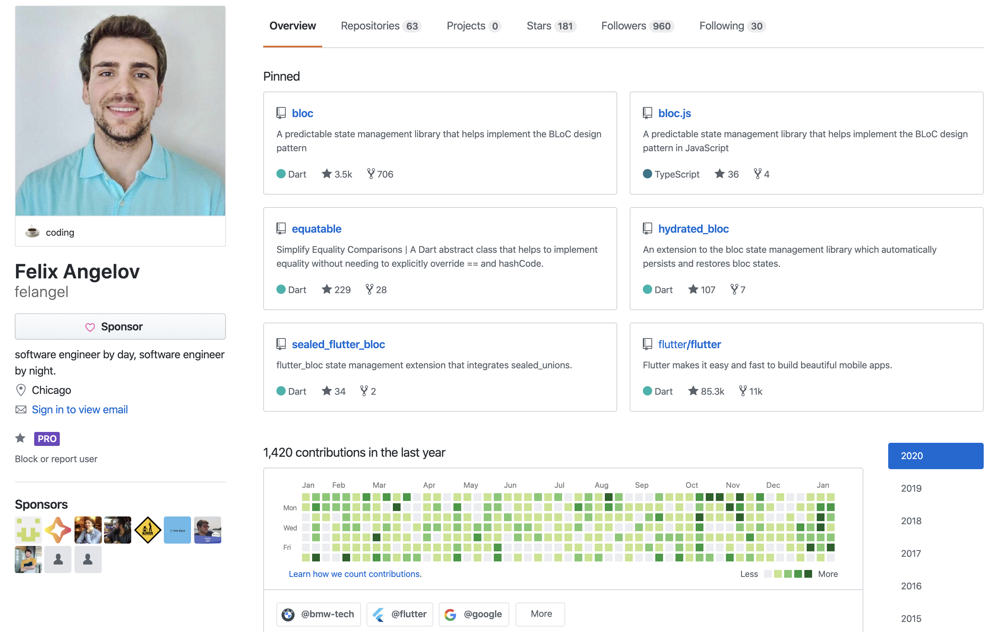
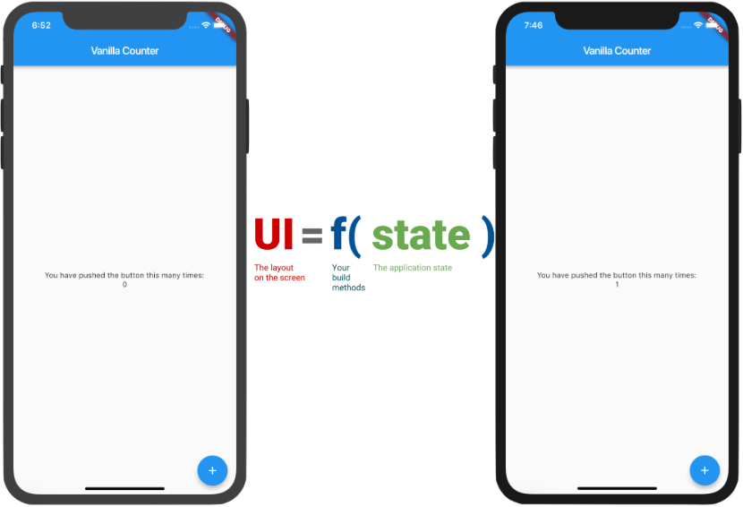
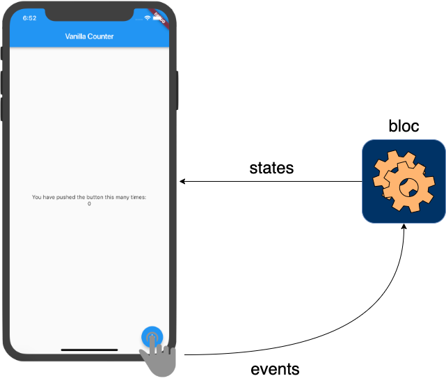
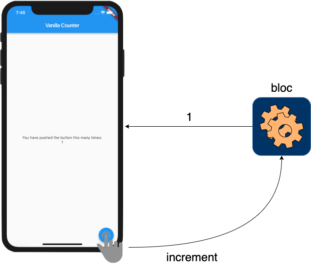

footer: @felangelov - flutter europe 2020
slidenumbers: true

# Bloc Library: Basics and Beyond 🚀

### Felix Angelov @ Very Good Ventures

---

# About Me



---

# So you need to build an app?

---

## Application State



#### "A system is described as stateful if it is designed to remember preceding events or user interactions; the remembered information is called the **state**"

[.footer: https://en.wikipedia.org/wiki/State_(computer_science)]

---

# Why State Management?s

### "There is (almost) always state in our applications therefore we are (almost) always managing state whether we know it or not."

[.footer: https://egghead.io/articles/what-is-state-why-do-i-need-to-manage-it]

---

# Goals

☐ separate presentation from logic
☐ test with ease
☐ develop efficiently (with many devs)
☐ maintainable/scalables
☐ logging/analytics

---

# Packages

- package:bloc - Core (Dart)
- package:bloc_test - Testing Helpers (Dart)
- package:flutter_bloc - Flutter Widgets
- package:angular_bloc - AngularDart Components

---

# Packages

- **package:bloc - Core (Dart)**
- package:bloc_test - Testing Helpers (Dart)
- package:flutter_bloc - Flutter Widgets
- package:angular_bloc - AngularDart Components

---

# Packages

- package:bloc - Core (Dart)
- **package:bloc_test - Testing Helpers (Dart)**
- package:flutter_bloc - Flutter Widgets
- package:angular_bloc - AngularDart Components

---

# Packages

- package:bloc - Core (Dart)
- package:bloc_test - Testing Helpers (Dart)
- **package:flutter_bloc - Flutter Widgets**
- package:angular_bloc - AngularDart Components

---

# Packages

- package:bloc - Core (Dart)
- package:bloc_test - Testing Helpers (Dart)
- package:flutter_bloc - Flutter Widgets
- **package:angular_bloc - AngularDart Components**

--

# Overview


> A bloc converts incoming events into outgoing states.

---

# Real-World



---

# Real-World: Increment



---

# Packages

- **package:bloc - Core (Dart)**
- package:bloc_test - Testing Helpers (Dart)
- package:flutter_bloc - Flutter Widgets
- package:angular_bloc - AngularDart Components

---

# package:bloc

```yaml
name: counter_bloc
description: A counter bloc example
version: 1.0.0

environment:
  sdk: ">=2.0.0 <3.0.0"

dependencies:
  bloc: ^3.0.0
```

---

[.code-highlight: 8-9]

# package:bloc

```yaml
name: counter_bloc
description: A counter bloc example
version: 1.0.0

environment:
  sdk: ">=2.0.0 <3.0.0"

dependencies:
  bloc: ^3.0.0
```

---

# bloc anatomy

```dart
import 'package:bloc/bloc.dart';
```

---

# bloc anatomy

[.code-highlight: 3]

```dart
import 'package:bloc/bloc.dart';

class CounterBloc extends Bloc<CounterEvent, int> {}
```

---

# bloc anatomy

[.code-highlight: 3]

```dart
import 'package:bloc/bloc.dart';

enum CounterEvent { increment, decrement }

class CounterBloc extends Bloc<CounterEvent, int> {}
```

---

# bloc anatomy

[.code-highlight: 6-7]

```dart
import 'package:bloc/bloc.dart';

enum CounterEvent { increment, decrement }

class CounterBloc extends Bloc<CounterEvent, int> {
    @override
    int get initialState => 0;
}
```

---

# bloc anatomy

[.code-highlight: 9-12]

```dart
import 'package:bloc/bloc.dart';

enum CounterEvent { increment, decrement }

class CounterBloc extends Bloc<CounterEvent, int> {
    @override
    int get initialState => 0;

    @override
    Stream<int> mapEventToState(CounterEvent event) async* {

    }
}
```

---

# bloc anatomy

[.code-highlight: 9-19]

```dart
import 'package:bloc/bloc.dart';

enum CounterEvent { increment, decrement }

class CounterBloc extends Bloc<CounterEvent, int> {
    @override
    int get initialState => 0;

    @override
    Stream<int> mapEventToState(CounterEvent event) async* {
        switch (event) {
            case CounterEvent.increment:
                yield state + 1;
                break;
            case CounterEvent.decrement:
                yield state - 1;
                break;
        }
    }
}
```

---

# bloc anatomy

```dart
import 'package:bloc/bloc.dart';

enum CounterEvent { increment, decrement }

class CounterBloc extends Bloc<CounterEvent, int> {
    @override
    int get initialState => 0;

    @override
    Stream<int> mapEventToState(CounterEvent event) async* {
        switch (event) {
            case CounterEvent.increment:
                yield state + 1;
                break;
            case CounterEvent.decrement:
                yield state - 1;
                break;
        }
    }
}
```

---

# Bloc

---

# package:bloc_test

---

# package:flutter_bloc

---

# package:hydrated_bloc

---

# package:sealed_flutter_bloc

---

# Tooling
